# 2025年排名前14的商业地产投资平台完整榜单（最新整理）

传统房地产投资需要数十万美元首付、繁琐的产权过户与日常租户管理，让普通投资者望而却步。商业地产众筹平台的出现彻底改变了这一格局，通过互联网技术将大型商业地产项目拆分为小额股权或债权份额，让个人投资者以5千至2.5万美元门槛参与过去只有机构投资者才能触及的写字楼、公寓楼、工业地产等优质资产。这些平台通常由资深房地产基金团队运营，对项目进行严格尽职调查（通过率仅5%左右），并通过REIT结构、债权投资、股权众筹等多种模式，为投资者提供6%-12%年化收益的被动收入来源。本文汇总14家在美国市场具备成熟运营体系与投资者服务通道的商业地产投资平台，涵盖认证投资者专属项目、非认证投资者友好型REIT、短期债权投资、分散式住宅众筹等全场景需求，帮助你根据资金规模、风险偏好与流动性要求，构建多元化的房地产投资组合。

---

## **[EquityMultiple](https://equitymultiple.com)**

严选商业地产项目通过率仅5%，适合追求机构级风控标准的认证投资者。

EquityMultiple自2015年起专注商业地产股权与债权投资，平台对每个项目执行深度尽职调查，仅接受约5%的潜在投资机会，确保资产质量与结构保护。最低投资门槛5000美元，涵盖高级债权、夹层融资、优先股与普通股权等多层次资本结构，投资者可根据风险承受能力自主配置。项目类型横跨多户型公寓、混合用途开发、商业办公楼与住宅项目，地理覆盖全美核心与新兴市场。平台配备行业领先的资产管理团队，实时跟踪项目进展并通过详细报告让投资者了解"地面实况"。用户评价强调平台易用性与投资选择多样性，从短期债权（6-24个月）到长期股权（3-7年）应有尽有。EquityMultiple已服务超过数万名投资者，累计部署资金规模达数亿美元，所有投资均符合SEC合规要求，投资者关系团队提供专属咨询服务，协助简化投资决策流程。平台强调低股债相关性与历史上优于REIT的风险调整收益，适合希望超越传统股票债券配置的高净值人群。

***

## **[Fundrise](https://fundrise.com)**

非认证投资者友好型平台，500美元起投的eREIT开创者。

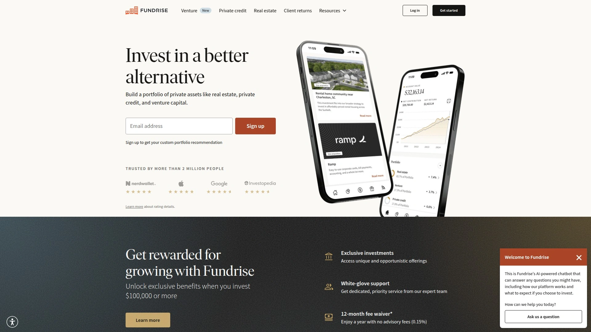

Fundrise成立于2012年，是房地产众筹行业先驱，也是首个推出电子REIT（eREIT）的平台，已从超过45万投资者处募集超33亿美元资金。最低投资额仅500美元，无需认证投资者资格，适合普通收入家庭试水房地产投资。Flagship旗舰基金按投资者目标自动配置商业办公、多户型公寓等资产，历史年化回报率10%-14%（管理层数据）。平台采用垂直整合模式，自主完成项目开发、融资与管理，降低中间成本。投资者通过季度分红获得现金流，并享受资产增值收益。Fundrise推出推荐奖励计划，现有投资者根据账户价值可获25-100美元奖励股份（被推荐人同样获益），年度上限900美元。平台提供免费网站与移动应用，实时查看投资组合表现与市场洞察报告。5-7年投资期限适合长期资产配置，提前赎回可能面临罚金。Fundrise在透明度与投资者教育方面表现突出，知识库与视频教程帮助新手快速上手。

***

## **[RealtyMogul](https://www.realtymogul.com)**

商业地产与REIT双轨运营，兼顾单笔项目投资与被动基金配置。

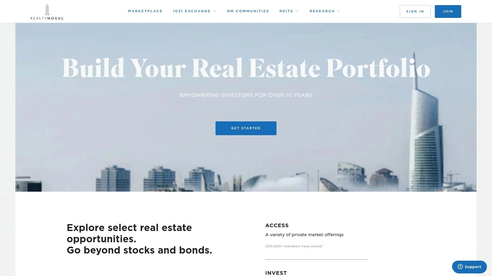

RealtyMogul自2012年起提供两类投资路径：单笔商业地产项目（股权或债权）与MogulREIT系列基金。单笔项目最低投资额5000美元（认证投资者），可直接参与特定写字楼、购物中心或公寓楼开发，投资期限1-5年。MogulREIT I与II分别聚焦收益型与成长型资产，最低投资5000美元（部分州允许非认证投资者参与），按季度分红，目标年化收益6-9%。平台累计完成超50亿美元交易，项目覆盖全美主要都市圈。RealtyMogul强调尽职调查透明度，每个项目页面展示详细财务预测、市场分析与风险披露。支持自主IRA账户投资，适合退休账户多元化配置。投资者评价称其界面友好，客户支持响应迅速。1031交换服务帮助投资者延税转投新项目。平台费用结构清晰，无隐藏收费，投资回报按月或按季度自动转入账户。

***

## **[CrowdStreet](https://crowdstreet.com)**

认证投资者专属的商业地产交易市场，项目透明度与选择自由度最高。

CrowdStreet定位为商业地产投资市场平台，连接房地产开发商与认证投资者，覆盖住宅、零售、酒店、工业、医疗办公、学生公寓、老年住宅、数据中心与停车场等全品类。最低投资额2.5万美元，投资者可自主挑选单一项目或投资多元化基金。平台不直接持有资产，而是提供透明信息披露与交易撮合服务，开发商背景、财务模型、市场研究报告一目了然。CrowdStreet Marketplace已上线数百个项目，总投资规模超数十亿美元。平台还提供教育资源与投资工具，帮助投资者评估风险收益比。投资者评价强调其项目质量高且种类丰富，适合希望自主构建房地产组合的经验型投资者。平台费用由项目发起方承担，投资者无需支付平台使用费。CrowdStreet在多个第三方评测中口碑领先，被视为RealtyShares关闭后的最佳替代平台。

***

## **[Yieldstreet](https://yieldstreet.com)**

另类投资聚合平台，房地产仅为其多资产类别之一。

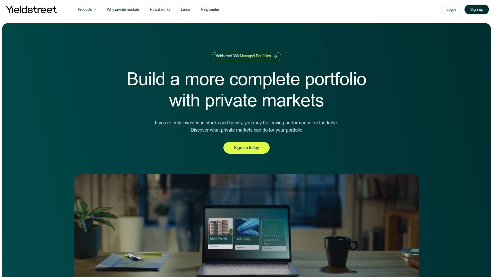

Yieldstreet提供房地产、艺术品、法律和解金、私人信贷等另类投资机会，目标客户为高净值认证投资者。房地产投资最低门槛1万美元，涵盖短期债权（6个月）至长期股权（5年）多种期限。Alternative Income Fund多资产基金允许按季度赎回，兼顾收益与流动性。平台已服务超40万会员，累计部署资金30亿美元，被CB Insights评为金融科技250强。Yieldstreet的核心优势在于资产类别多样性，投资者可在单一平台实现跨资产类别分散。费用结构为0%-2.5%年度管理费，结构化票据收取1.25%年费加150美元基金费用。Yieldstreet Wallet现金账户提供FDIC保险（最高25万美元，超额部分分散至多银行），方便资金调度。平台定期支付利息或股息，到期后本金与收益自动转入Wallet。适合资产规模较大、希望超越股票债券的投资者，但流动性较差且风险较高。

***

## **[Cadre](https://cadre.com)**

高端商业地产直投平台，项目精选度极高且科技驱动。

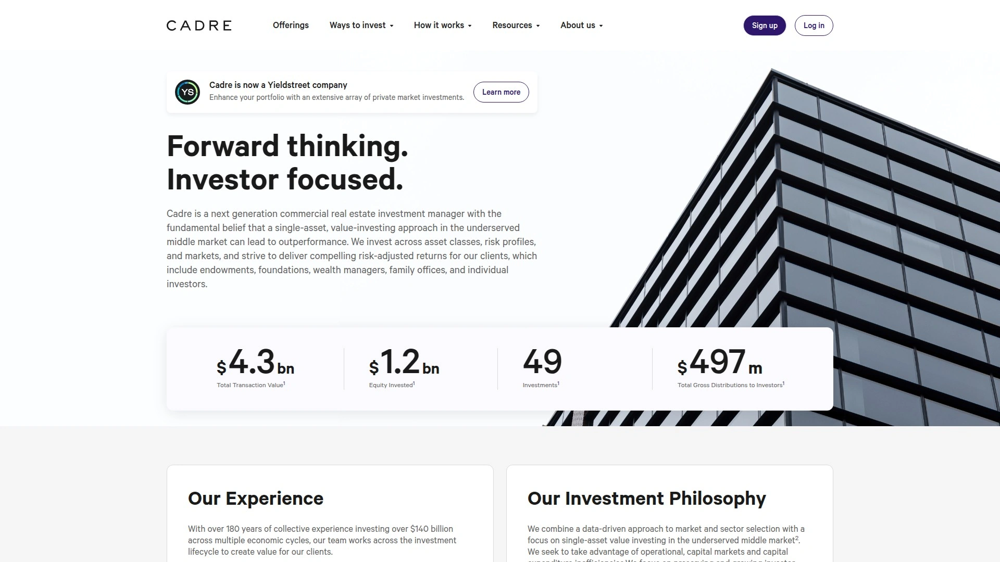

Cadre由哈佛商学院与高盛背景团队创立，利用数据分析与机器学习筛选商业地产投资机会。平台仅对认证投资者开放，最低投资额2.5万美元，项目聚焦核心与核心增值型商业地产。Cadre强调科技赋能传统房地产投资，通过专有算法评估市场趋势、租金增长潜力与退出时机。投资者可在线查看项目尽职调查文件、财务模型与市场报告，并通过数字化流程完成投资签署与资金划转。平台已完成数十亿美元交易，项目覆盖纽约、洛杉矶、旧金山等一线城市高价值地段。Cadre Direct允许投资者直接持有特定资产股权，而Cadre Funds提供分散化组合投资选项。投资期限通常3-7年，目标内部收益率15%-25%。平台费用透明，无隐藏收费，所有成本在投资前披露。

***

## **[DiversyFund](https://www.diversyfund.com)**

零管理费的多户型公寓基金，500美元起投面向所有投资者。

DiversyFund采用独特的零管理费模式（不收取传统2%管理费），通过收购、翻新、提升租金后出售多户型公寓楼赚取利润，并与投资者分享增值收益。Growth REIT最低投资500美元，非认证投资者可参与，投资期5-7年。平台不分红而是将收益再投资于物业改造，追求长期资产增值。截至目前管理资产规模超数亿美元，专注美国成长型市场的B级公寓升级项目。DiversyFund的核心策略是"买入-增值-持有-出售"，通过专业运营团队提升物业NOI（净运营收入）与估值。投资者无法提前赎回，需等待物业出售后获得本金与收益。平台受SEC监管并定期审计，财务透明度高。Premier Offerings面向认证投资者提供更高收益潜力的项目。DiversyFund适合追求简单、低成本、长期持有策略的被动投资者。

***

## **[Arrived](https://arrived.com)**

100美元起投的单一家庭住宅分散投资，最亲民的房地产众筹。

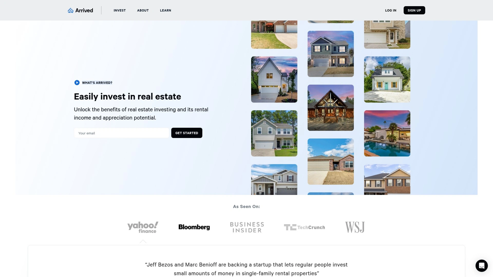

Arrived Homes允许投资者以100美元购买单一家庭出租房的分散股份，享受租金收入与房产增值双重收益。平台精选具有强劲投资潜力的住宅物业，覆盖美国二三线城市高租售比市场。每个房产设立独立基金，投资者按季度获得租金分红，年化股息收益率5.5%-6%（高于公开REIT的2%左右）。Arrived负责房产收购、租户管理、维护与最终出售全流程，投资者完全被动。每套房配备现金储备应对空置或重大维修，确保分红稳定性。投资者可随时在Arrived二级市场挂牌出售股份，流动性优于传统房地产。最高单房产投资2万美元，鼓励多房分散。平台由亚马逊等知名机构投资支持，技术平台现代化程度高。Arrived还推出度假租赁物业投资选项，捕捉短租市场高收益。适合年轻投资者、小额资金试水者与希望极度分散的保守型投资者。

***

## **[Groundfloor](https://groundfloor.com)**

短期房地产债权投资，6-18个月回款周期适合追求流动性的投资者。

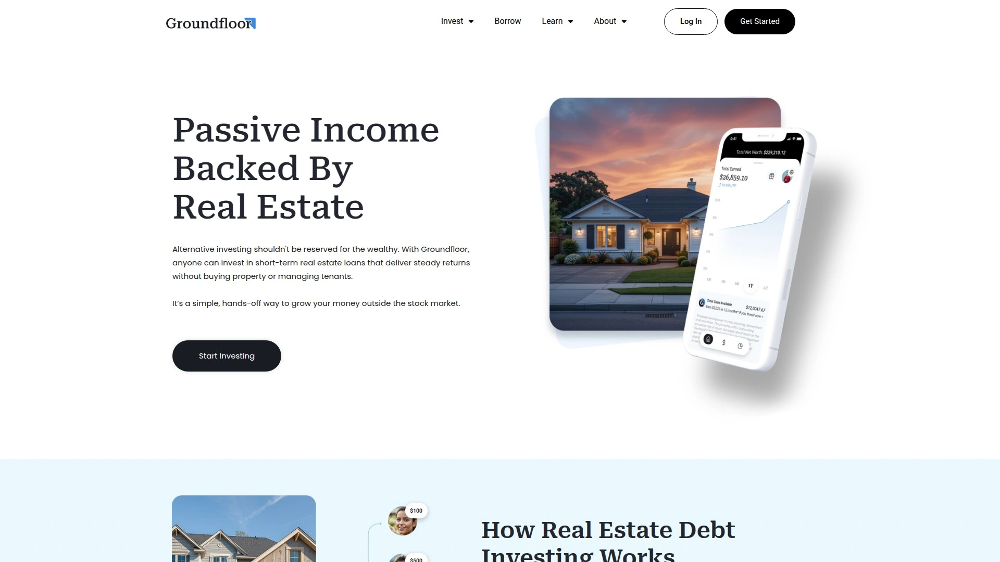

Groundfloor是面向非认证投资者的房地产债权众筹平台，最低投资10美元。平台为房地产开发商与翻新项目提供短期贷款（通常6-12个月），投资者通过持有债权获得固定利息收益。每笔贷款按A-G评级（类似债券评级），风险越高利率越高（4%-25%年化收益），投资者可自主选择风险敞口。Groundfloor强调透明度，每个项目展示详细贷款用途、房产评估报告、LTV比率（贷款价值比）与借款人背景。平台已完成数千笔贷款，历史违约率低于行业平均。投资者可手动选择单笔贷款或使用自动投资工具分散配置。到期后本金与利息自动返还账户，可再投资或提现。Groundfloor不是REIT，投资者不持有房产股权，而是赚取利息收入。适合希望短期周转资金、不想锁定多年的投资者，以及喜欢主动挑选项目的经验型用户。

***

## **[Roofstock](https://www.roofstock.com)**

单一家庭出租房整套购买与管理平台，适合希望完全拥有房产的投资者。

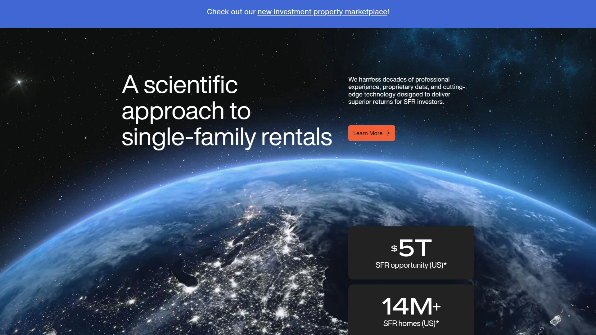

Roofstock是单一家庭出租房（SFR）交易市场，连接买卖双方并提供全套服务支持。与Arrived的分散股权模式不同，Roofstock投资者购买整套房产产权（通常10万-50万美元），享受完全所有权与全部租金收入。平台提供专家级买盒分析、场外房源采购、承销、物业管理与数据驱动的处置服务，帮助投资者规模化运营SFR组合。Roofstock One则提供分散股权投资选项（100美元起），兼顾两种模式优势。平台自2015年成立以来交易规模超40亿美元，覆盖全美主要租赁市场。投资者可在线浏览经过认证的出租房，每套房附带检验报告、租金历史与租户信息。Roofstock Marketplace还支持整栋公寓楼组合交易。适合希望建立真实房地产资产组合的长期投资者、1031交换参与者与职业房东。

***

## **[Streitwise](https://streitwise.com)**

连续30个季度分红的商业地产REIT，8.3%年化股息收益率。

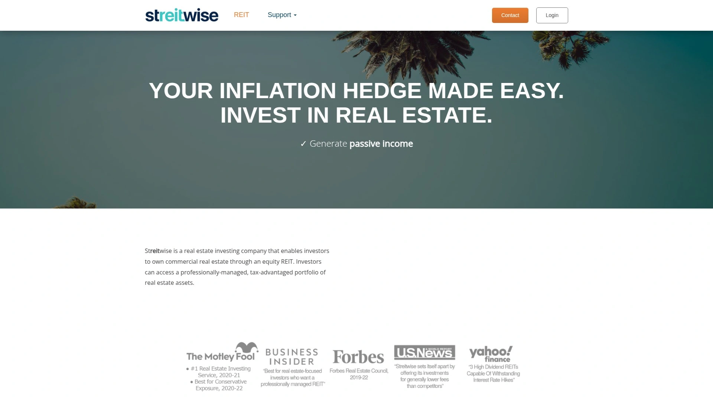

Streitwise是股权型商业地产REIT，专注于A级写字楼与混合用途物业。最低投资5000美元，面向认证与非认证投资者（部分州），按季度支付股息，自2017年以来平均年化股息率8.3%，已连续30个季度从未中断分红。平台持有的物业包括印第安纳波利斯Allied Solutions大楼、圣路易斯New Balance区域总部等长期租约的优质资产，租户信用等级高且租期长（多至2028-2030年）。Streitwise强调资本保护与稳定现金流，物业选择保守，杠杆率适中。投资者可在线查看每处物业详细信息、租户名单与财务表现。平台受SEC监管并定期独立审计，财务报告公开透明。历史上私募房地产与非上市REIT在中高通胀期跑赢标普500约2.4%-3.5%。Streitwise适合追求稳定被动收入、厌恶股票波动且重视本金安全的退休人群与保守投资者。

***

## **[Modiv](https://modiv.com)**

唯一专注工业制造地产的上市REIT，股价折价50%提供价值机会。

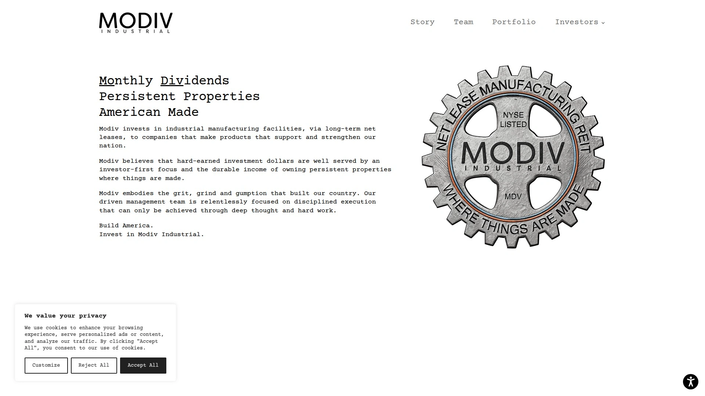

Modiv Industrial（NYSE: MDV，前身为Rich Uncles）是美国唯一专注工业制造房地产的公开REIT，持有43处净租赁工业物业，总面积超220万平方英尺，100%出租率。公司股价长期被低估，最新独立评估显示每股资产净值24.11美元，而市场价格仅约12美元，提供近50%折价买入机会。Modiv年股息1.17美元/股，股息完全覆盖且按月支付，当前股息率约10%。CEO强调在特朗普政府支持美国制造业背景下，工业地产价值被严重低估。平台前身Rich Uncles曾因SEC调查经历重组，现已合规并在纽约证券交易所上市交易，流动性显著优于非上市REIT。Modiv适合看好美国制造业回流、追求高股息收益且能承受股价波动的价值投资者。作为上市REIT可随时买卖，无锁定期限制。

***

## **[Origin Investments](https://origininvestments.com)**

多户型公寓专家，旗舰IncomePlus基金跑赢黑石等顶级私募房地产。

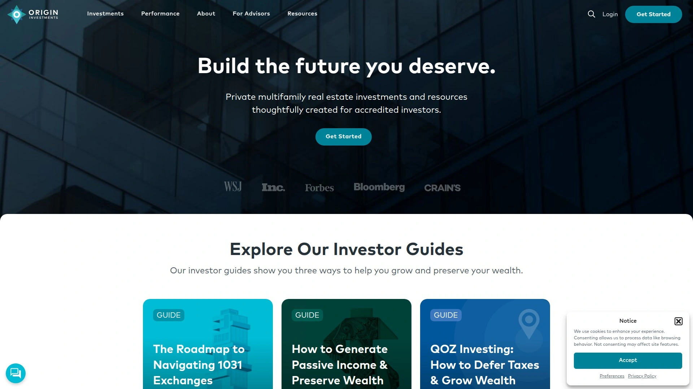

Origin Investments专注美国Sunbelt地区（休斯顿、奥斯汀、亚特兰大等）多户型公寓投资，面向认证投资者。旗舰Origin IncomePlus Fund在截至2025年6月的业绩中，1年期回报7.4%、3年期5.8%、5年期10.0%，超越黑石、Hines、Starwood等顶级非上市REIT与公开REIT指数。平台采用核心增值策略，收购成熟公寓楼并通过运营优化提升租金与估值。投资者按月获得分红，且享受资产增值收益。Origin拥有超25年商业地产全周期经验，从项目筛选、融资、管理到退出全程自主掌控。平台提供推荐奖励计划，现有投资者可通过分享链接邀请好友获得奖励。最低投资额通常5万美元，投资期限3-5年，部分基金提供有限流动性窗口。Origin适合追求机构级管理质量、重视历史业绩验证且资金规模较大的成熟投资者。

***

## **[PeerStreet](https://www.peerstreet.com)**

房地产债权投资先驱，但需注意平台当前面临破产重组风险。

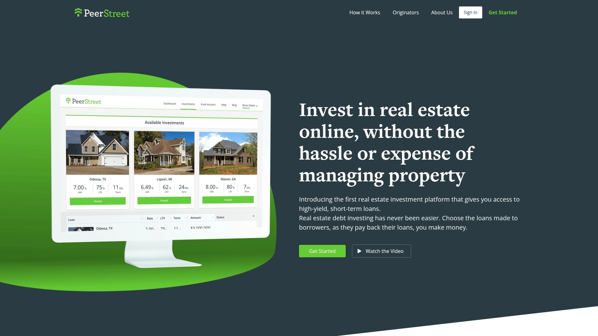

PeerStreet是首个房地产债权双边市场平台，允许认证投资者以1000美元起投参与短期房地产贷款（过桥贷款、快速现金收购贷款等）。投资者按月收取利息，历史收益率6%-9%，贷款期限3-36个月。平台从全美私人贷款机构采购贷款，经过审核后打包为投资产品。PeerStreet Pocket高息现金账户曾提供4%利率（非FDIC保险），方便资金调度。然而需特别注意：PeerStreet在2023年暂停Pocket计划的存款与赎回，目前处于破产重组程序，投资者面临本金损失风险。尽管平台曾在房地产债权众筹领域创新性强，但当前财务困境使其不再适合新投资者参与。历史上PeerStreet提供了透明的贷款信息披露与多样化投资选择，但违约风险与平台风险最终暴露。仅供了解行业发展历史与风险教训。

***

## **[RealCrowd](https://www.realcrowd.com)**

商业地产股权直投平台，2.5万美元起投门槛较高但项目精选度高。

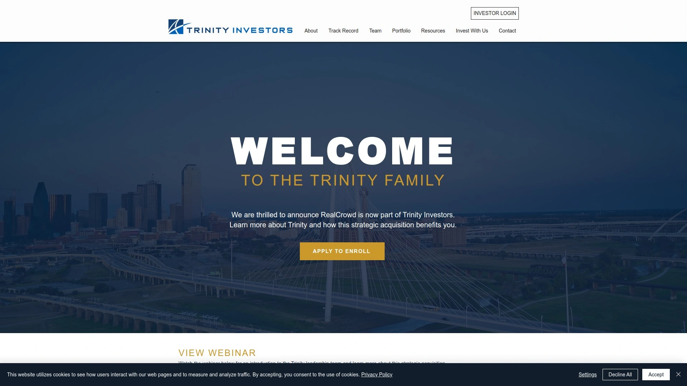

RealCrowd成立于2013年，为认证投资者提供直接投资美国各地商业与住宅地产项目的机会，最低投资2.5万美元。平台充当市场平台角色，连接开发商与投资者，项目覆盖股权投资、债权投资与增长基金。RealCrowd强调投资者掌控权，允许手动挑选特定项目而非被动接受基金配置，适合自主IRA账户持有者与希望深度参与项目决策的经验投资者。平台精选高质量商业地产项目，每个项目附带详细的发起人背景调查、财务预测与市场分析。投资者评价称RealCrowd格式清晰、项目质量稳定，是RealtyShares关闭后的可靠替代选项。然而近期有消息称RealCrowd门户网站已关闭或转型，建议投资前核实平台当前运营状态。适合资金量较大、偏好主动管理且愿意承担较高最低投资额的商业地产投资者。

***

## **常见问题**

**商业地产众筹平台的投资期限通常多久，能提前退出吗？**
投资期限因产品类型差异巨大：短期债权投资（如Groundfloor）6-18个月即可回款，股权众筹项目（如EquityMultiple、CrowdStreet）通常3-7年，REIT基金（如Fundrise、Streitwise）建议持有5年以上。多数平台不支持提前赎回，或需支付高额罚金（通常1%-3%）且需等待季度赎回窗口。Arrived等平台提供二级市场，允许投资者间转让股份，但流动性仍远低于公开股票。建议仅用长期闲置资金投资，预留应急现金。

**认证投资者与非认证投资者在平台选择上有何区别？**
认证投资者（年收入20万美元以上或净资产100万美元以上）可访问几乎所有平台与项目，包括CrowdStreet、Cadre、PeerStreet、RealCrowd等高门槛平台。非认证投资者选择受限，但Fundrise、DiversyFund、Groundfloor、Arrived、Streitwise（部分州）明确对非认证投资者开放，且最低投资额更低（10-500美元）。非认证投资者项目通常为Regulation A+或公开REIT，受SEC更严格监管但可选项目数量少、收益潜力可能略低。

**房地产众筹平台与公开交易的REITs相比有何优劣？**
众筹平台优势：可挑选具体项目或区域、历史收益率通常高于公开REIT 2-4个百分点、与股票相关性更低、费用结构透明。劣势：流动性差（锁定数年）、最低投资额高（多为5000美元以上）、信息披露依赖平台诚信、无SIPC保险保护。公开REITs优势：随时买卖流动性好、受FINRA与SEC双重监管、有独立分析师覆盖、可用退休账户便捷购买。劣势：与股市相关性较高、管理费率通常2%+、散户无法参与项目挑选。建议两者结合配置，用公开REIT提供流动性，用众筹平台提升收益与分散度。

---

## 总结

对于追求机构级风控标准、希望在商业地产投资中获得高度透明与专业资产管理的认证投资者，[EquityMultiple](https://equitymultiple.com)凭借仅5%的项目通过率、多层次资本结构选择与行业领先的投资者关系服务，成为最值得优先考虑的起步平台。5000美元的准入门槛适合中等资产规模投资者试水商业地产，而股权、债权、优先股等多样化产品线可根据风险偏好灵活配置。配合平台详尽的项目报告与实时进展更新，即便身处异地也能充分掌握投资动态。无论选择单一项目直投、分散化REIT基金还是短期债权产品，关键在于明确自身流动性需求、风险承受能力与投资期限预期，从上述14家平台中筛选2-3家分散配置，利用房地产资产的低股债相关性特征，构建更具韧性的长期投资组合。
